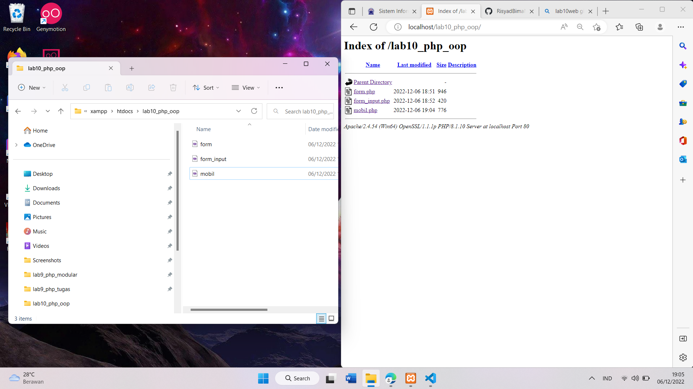
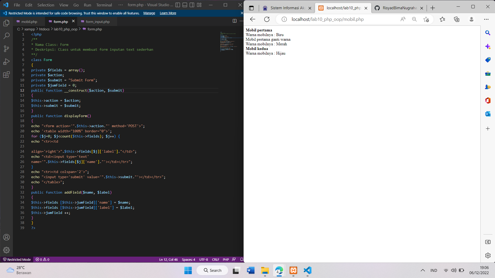
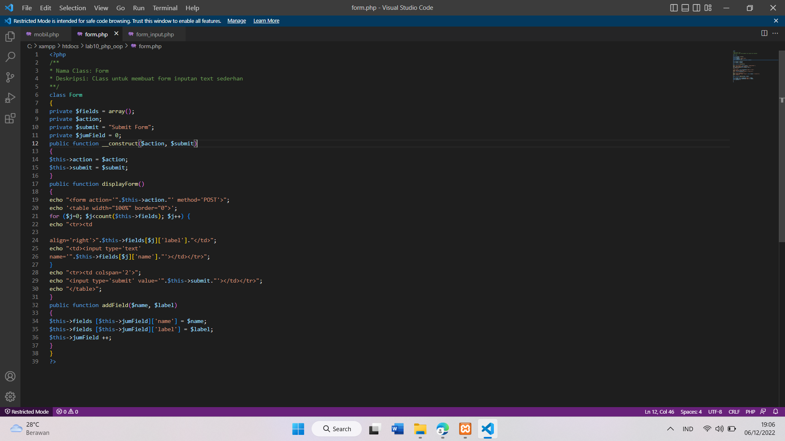
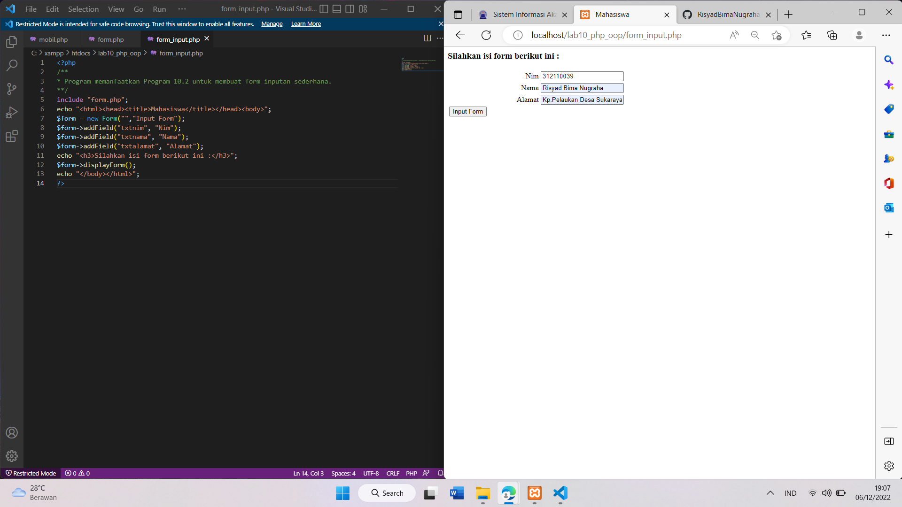

# Lab10Web
<b>Nama	: Risyad Bima Nugraha

NIM		: 312110039

Kelas	: TI.21.B1

Matkul	: Pemrograman Web

Langkah Langkah praktikum:</b>

1.	Buat folder baru dengan nama lab10_php_oop pada folder htdocs

2.	Buat file baru dengan nama mobil.php seperti berikut

 
3.	Buat file baru dengan nama form.php seperti berikut

 

4.	Buat file baru dengan nama form_input.php seperti berikut

# TERIMAKASI